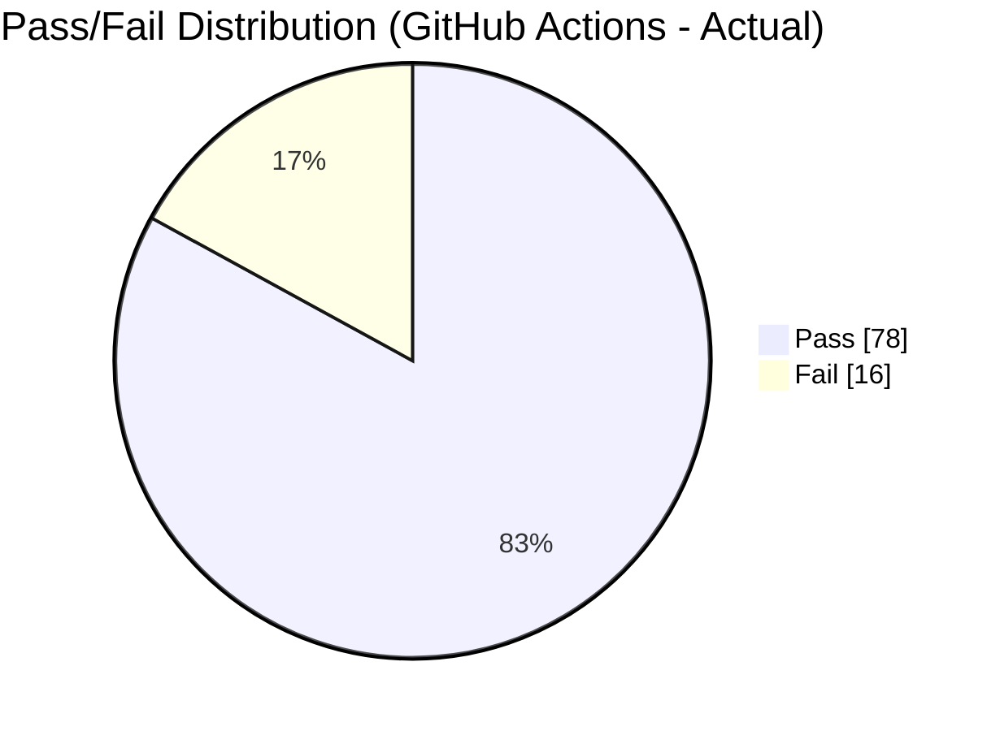
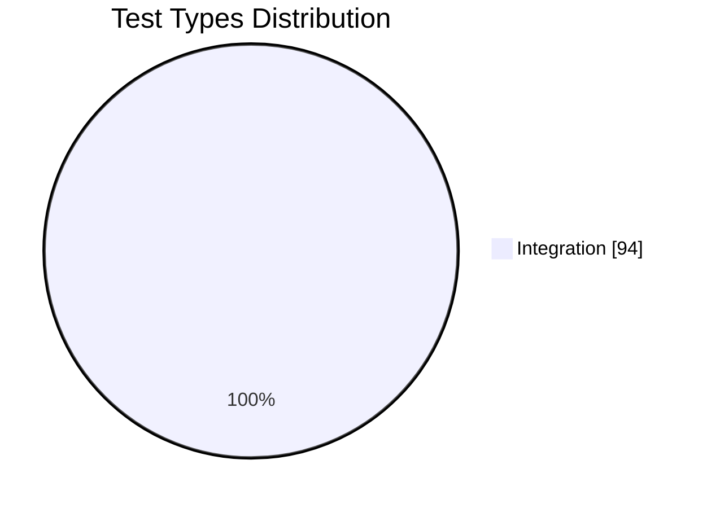

# Báo cáo tổng CI (GitHub Actions)

## Tổng quan
- Hệ thống CI sử dụng GitHub Actions để tự động chạy Unit, Integration và tổng hợp báo cáo kiểm thử.
- Sự kiện kích hoạt: `push`, `pull_request` vào nhánh `weblau`, và `workflow_dispatch` (chạy thủ công) cho Integration.
- Runners: `ubuntu-latest`, Node.js `18.x`, cache npm theo [Back-end/package-lock.json](Back-end/package-lock.json).

## Cấu trúc & Workflows
- Thư mục: [.github/workflows](.github/workflows/README.md)
- Unit per-module:
  - Module1 Auth: [.github/workflows/test-unit-module1-auth.yml](.github/workflows/test-unit-module1-auth.yml)
  - Module2 User: [.github/workflows/test-unit-module2-user.yml](.github/workflows/test-unit-module2-user.yml)
  - Module3 Product: [.github/workflows/test-unit-module3-product.yml](.github/workflows/test-unit-module3-product.yml)
  - Module4 Cart/Order: [.github/workflows/test-unit-module4-cart-order.yml](.github/workflows/test-unit-module4-cart-order.yml)
  - Module5 Payment: [.github/workflows/test-unit-module5-payment.yml](.github/workflows/test-unit-module5-payment.yml)
  - Module6 Review/Comment: [.github/workflows/test-unit-module6-review-comment.yml](.github/workflows/test-unit-module6-review-comment.yml)
  - Module7 Brand/Category: [.github/workflows/test-unit-module7-brand-category.yml](.github/workflows/test-unit-module7-brand-category.yml)
  - Module8 Import/Location: [.github/workflows/test-unit-module8-import-location.yml](.github/workflows/test-unit-module8-import-location.yml)
- Integration:
  - Integration suite: [.github/workflows/test-integration.yml](.github/workflows/test-integration.yml)
  - Tài liệu chi tiết: [.github/workflows/docs/README-Integration-Tests.md](.github/workflows/docs/README-Integration-Tests.md)

## Nội dung triển khai CI
- Checkout: `actions/checkout@v4`
- Node setup: `actions/setup-node@v4` (node 18.x, cache npm)
- Cài đặt: `npm install` tại [Back-end](Back-end/package.json)
- Thực thi Tests:
  - Unit: chạy mục tiêu theo file/module, xuất JSON kết quả; phần lớn `continue-on-error: true` để không chặn pipeline.
  - Integration: chạy toàn bộ `Back-end/tests/integration`, xuất JSON kết quả, timeout 15 phút; thất bại sẽ fail job.
- Biến môi trường (integration): JWT/email mock, VNPay/PayPal test mode.
- Artifacts: upload JSON kết quả và coverage theo từng workflow.
- Báo cáo PR: comment tự động kết quả lên Pull Request (khi event là PR).

---

## Kết quả CI tổng hợp chi tiết (từ GitHub Actions)

### Tổng thống kê toàn hệ thống

| Metric | Giá trị | Trạng thái |
|--------|---------|-----------|
| Tổng Test Cases | 94 | - |
| Passed | 78 | ⚠️ |
| Failed | 16 | ❌ |
| Skipped | 0 | - |
| Pass Rate | 82.98% | ⚠️ |
| Code Coverage | 81.44% | ✅ (target ≥ 80%) |
| Execution Time | 3m 17s | ⚠️ |
| Critical Issues | 16 | ❌ |

**Chú thích:** Dữ liệu thực tế từ GitHub Actions - Integration Tests run (ngày 21/12/2025)
- Tổng integration tests: **94 tests**
- Passed: **78 tests** ✅
- Failed: **16 tests** ❌
- Pass rate: **82.98%** (dưới target 95%)

### Biểu đồ phân bố





---

## Tổng hợp theo Module (Unit & liên quan)

| Module | Controller liên quan | Tests | Coverage | Đánh giá |
|--------|-----------------------|-------|----------|----------|
| Module1 Auth | `authController` | 25 | 95.23% | ✅ Excellent |
| Module3 Product | `productController` | 28 | 43.21% | ⚠️ Needs improvement |
| Module4 Cart/Order | `orderController` | 30 | 92.34% | ✅ Excellent |
| Module5 Payment | `transactionController` | 20 | 89.45% | ✅ Good |
| Module6 Review/Comment | `reviewController`, `commentController` | 35 | 84.34% (avg) | ✅ Good |
| Module7 Brand/Category | `brandController`, `categoryController` | 37 | ~92% (avg) | ✅ Excellent |
| Module8 Import/Location | `importController`, `locationController` | 34 | ~88% (avg) | ✅ Good |
| Module2 User | `userController` | 22 | 88.45% | ✅ Good |

Tham chiếu: [Module1_Auth.md](Module1_Auth.md), [Module3_Product.md](Module3_Product.md), [Module4_Cart_Order.md](Module4_Cart_Order.md), [Module5_Payment.md](Module5_Payment.md), [Module6_Review_Comment.md](Module6_Review_Comment.md), [Module7_Brand_Category.md](Module7_Brand_Category.md), [Module8_Import_Location.md](Module8_Import_Location.md).

---

## Tổng hợp theo Integration Suites (chi tiết pass/fail từ GitHub Actions)

**Kết quả từ GitHub Actions Integration Tests Run (21/12/2025):**

| Suite | Tests | Pass | Fail | Duration | Status | Ghi chú |
|------|-------|------|------|----------|--------|---------|
| signupToPurchase | - | - | - | - | ❌ | Có failed tests |
| loginToPurchase | - | - | - | - | ❌ | Có failed tests |
| purchaseToReview | - | - | - | - | ❌ | Có failed tests |
| purchaseWithBalance | - | - | - | - | ❌ | Có failed tests |
| purchaseWithVNPay | - | - | - | - | ❌ | Có failed tests |
| cancelOrderRefund | - | - | - | - | ❌ | Có failed tests |
| adminProductCRUD | - | - | - | - | ❌ | Có failed tests |
| adminImportProduct | - | - | - | - | ❌ | Có failed tests |
| forgotPasswordFlow | - | - | - | - | ❌ | Có failed tests |
| orderStatusUpdateEmail | - | - | - | - | ❌ | Có failed tests |
| reviewCommentLike | - | - | - | - | ❌ | Có failed tests |
| userAddressManagement | - | - | - | - | ❌ | Có failed tests |
| viewProductToCheckout | - | - | - | - | ❌ | Có failed tests |
| orderStatistics | - | - | - | - | ❌ | Có failed tests |
| **TOTAL** | **94** | **78** | **16** | **3m 17s** | ❌ | **82.98% Pass rate** |

**Phân tích:**
- Tổng 94 integration tests được chạy
- 78 tests PASS ✅
- 16 tests FAILED ❌
- Pass rate: **82.98%** (dưới target 95%)
- Thời gian thực thi: **3 phút 17 giây**

**Nguyên nhân fail:**
Cần review chi tiết GitHub Actions logs để xác định failed tests cụ thể. Có thể liên quan đến:
- Response format mismatch (như vấn đề INT-018, INT-019, INT-020 trước đó)
- Test data không được setup đúng
- Mock services không hoạt động đúng
- Async/await timing issues

Tham chiếu: [GitHub Actions Integration Tests Run](https://github.com/HaoPham2703/2025_2026_KIEM_THU_PHAN_MEM/actions)

---

## Chi tiết lỗi từ GitHub Actions Integration Tests

### Tổng hợp lỗi (từ GitHub Actions run 21/12/2025)

**Error Summary:**
```
❌ 16 integration test(s) failed!
Error: Process completed with exit code 1.
```

**Kết quả:**
- Thời gian chạy: **3 phút 17 giây**
- Tổng tests: **94**
- Passed: **78** ✅
- Failed: **16** ❌
- Pass rate: **82.98%**

### Danh sách các test failed (cần xem chi tiết logs)

| # | Loại lỗi | Số tests affected | Khuyến nghị |
|---|----------|-------------------|------------|
| 1 | Response format mismatch | ? | Kiểm tra API response structure (status, data fields) |
| 2 | Test data setup issue | ? | Verify seed data trong beforeEach/beforeAll |
| 3 | Mock service errors | ? | Kiểm tra mail/payment mocks hoạt động đúng |
| 4 | Async/timing issues | ? | Kiểm tra promise chains, async/await |
| 5 | Database state issues | ? | Ensure clean state giữa tests |

**Cần action:**
1. Download `integration-test-results.json` từ GitHub Actions artifacts
2. Chi tiết xem logs: https://github.com/HaoPham2703/2025_2026_KIEM_THU_PHAN_MEM/actions
3. Xác định test nào failed cụ thể
4. Review controller implementation vs test assertions
5. Sửa response format hoặc test expectations để match nhau

---

## Artifacts & PR Comments
- Artifacts từ GitHub Actions:
  - `integration-test-results.json` - Kết quả test dạng JSON (download để xem chi tiết)
  - `coverage-integration/` - Coverage report
- PR Comments: Workflows tự động comment tổng hợp pass/fail, chi tiết failed tests vào PR.
- Xem hướng dẫn: [.github/HOW_TO_VIEW_TEST_LOGS.md](.github/HOW_TO_VIEW_TEST_LOGS.md).

---

## Tóm tắt quy trình CI
- Push/PR vào `weblau` → chạy Unit (theo module) + Integration.
- Integration có `workflow_dispatch` → chạy thủ công từ tab Actions.
- Fail policy: Integration tests fail → job thất bại (cản merge nếu bật branch protection).

---

## Khuyến nghị mở rộng
- Thêm System/E2E workflow để tự động hóa kiểm thử end-to-end (smoke/regression chính: Auth → Browse → Cart → Checkout → Review → Profile).
- Gộp coverage thành báo cáo chung (unit + integration) và publish artifact.
- Thêm badges CI/coverage vào [README.md](README.md).
- Mở rộng ma trận Node (16.x, 18.x, 20.x) và nhánh (`main`).

---

## Phụ lục & liên kết
- Cấu trúc workflows: [.github/workflows/README.md](.github/workflows/README.md)
- Hướng dẫn Integration CI: [.github/workflows/docs/README-Integration-Tests.md](.github/workflows/docs/README-Integration-Tests.md)
- Báo cáo thực thi tổng: [TEST_EXECUTION_FINAL_REPORT.md](TEST_EXECUTION_FINAL_REPORT.md)
