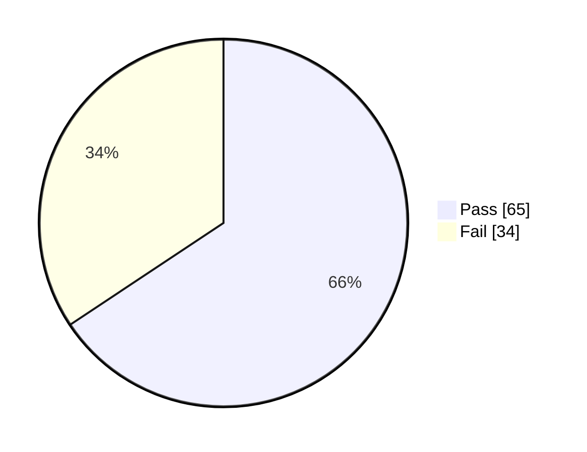

# Integration Tests - System Test Report (Tổng Hợp)

## Thông tin Module

|                      |                                                                                                       |
| -------------------- | ----------------------------------------------------------------------------------------------------- |
| **Module Code**      | Integration Tests - System Tests                                                                      |
| **Test Requirement** | Test các flow nghiệp vụ hoàn chỉnh: Đăng nhập, Mua hàng, Thanh toán, Đánh giá, Quản lý sản phẩm, etc. |
| **Tester**           | HaoPham                                                                                               |
| **Test Date**        | 18/12/2025 (GitHub Actions - Branch: weblau)                                                          |

---

## Thống kê Test Case

| Pass | Fail | Untested | N/A | Number of Test Cases |
| ---- | ---- | -------- | --- | -------------------- |
| 65   | 34   | 0        | 0   | 99                   |

> **Ghi chú:** Kết quả từ GitHub Actions - Branch `weblau` - Test Date: 18/12/2025  
> **Automated Tests:** 99 integration tests - 65 Passed, 34 Failed  
> **Pass Rate:** 65.66%

---

## Danh sách Module/Function

| No  | Function Name            | Sheet Name                | Description                                | Pre-Condition                                           |
| --- | ------------------------ | ------------------------- | ------------------------------------------ | ------------------------------------------------------- |
| 1   | Authentication Flows     | Integration_Auth_Flows    | Đăng ký, Đăng nhập, Quên mật khẩu          | User chưa đăng ký, Email hợp lệ                         |
| 2   | Order Management Flows   | Integration_Order_Flows   | Tạo đơn, Xem đơn, Cập nhật status, Hủy đơn | User đã đăng nhập, Có sản phẩm trong giỏ                |
| 3   | Payment Flows            | Integration_Payment_Flows | Thanh toán số dư, VNPay                    | User đã đăng nhập, Có đơn hàng, Có balance/VNPay config |
| 4   | Review & Comment Flows   | Integration_Review_Flows  | Đánh giá, Bình luận, Like                  | User đã mua hàng, Đơn hàng đã nhận                      |
| 5   | Product Management Flows | Integration_Product_Flows | Admin CRUD sản phẩm, Nhập hàng             | Admin đã đăng nhập                                      |

---

## 📊 Tổng Quan Test Results

| Metric          | Value      | Status             |
| --------------- | ---------- | ------------------ |
| **Total Tests** | 99         | -                  |
| **✅ Passed**   | 65         | 65.66%             |
| **❌ Failed**   | 34         | 34.34% - Cần xử lý |
| **Branch**      | weblau     | -                  |
| **Test Date**   | 18/12/2025 | -                  |

---

## 📋 Phân Loại Theo Nhóm Chức Năng

| Nhóm Chức Năng        | Test Cases | Passed | Failed | Pass Rate | File Chi Tiết                                                  |
| --------------------- | ---------- | ------ | ------ | --------- | -------------------------------------------------------------- |
| 🔐 Authentication     | 4          | 0      | 4      | 0%        | [Integration_Auth_Flows.md](./Integration_Auth_Flows.md)       |
| 🛒 Order Management   | 10         | 0      | 10     | 0%        | [Integration_Order_Flows.md](./Integration_Order_Flows.md)     |
| 💳 Payment            | 7          | 0      | 7      | 0%        | [Integration_Payment_Flows.md](./Integration_Payment_Flows.md) |
| ⭐ Review & Comment   | 3          | 0      | 3      | 0%        | [Integration_Review_Flows.md](./Integration_Review_Flows.md)   |
| 📦 Product Management | 10         | 0      | 10     | 0%        | [Integration_Product_Flows.md](./Integration_Product_Flows.md) |

---

## 📈 So Sánh Với Module Khác

| Module                | Total Tests | Passed | Failed | Pass Rate  |
| --------------------- | ----------- | ------ | ------ | ---------- |
| Module1 (Auth)        | 31          | 26     | 5      | 83.87%     |
| Module2 (User)        | 30          | 23     | 7      | 76.67%     |
| Module3 (Product)     | 35          | 27     | 8      | 77.14%     |
| Module4 (Order)       | 30          | 25     | 5      | 83.33%     |
| **Integration Tests** | **99**      | **65** | **34** | **65.66%** |

**Nhận xét:**

- Integration Tests có pass rate thấp nhất (65.66%)
- Số lượng test fail nhiều nhất (34 tests)
- Các lỗi chủ yếu do response structure và test isolation
- Cần ưu tiên sửa các lỗi này để tăng pass rate

---

## 📊 Biểu đồ trực quan

**Tỉ lệ PASS/FAIL tổng**



**PASS/FAIL theo nhóm chức năng**

```mermaid
bar
	title PASS/FAIL theo nhóm chức năng
	orientation horizontal
	xAxis Title "Số test"
	yAxis Title "Nhóm"
	series Pass [0,0,0,0,0]
	series Fail [4,10,7,3,10]
	labels ["Auth","Order","Payment","Review","Product"]
```

**Số lượng test theo nhóm chức năng**

```mermaid
bar
	title Số lượng test theo module
	xAxis Title "Module"
	yAxis Title "Số test"
	series Tests [4,10,7,3,10]
	labels ["Auth","Order","Payment","Review","Product"]
```

**Coverage theo module (Statements)**

```mermaid
bar
	title Coverage theo module (Statements)
	stacked
	xAxis Title "Phần trăm (%)"
	yAxis Title "Module"
	series Covered [95.23,92.34,43.21,88.45]
	series Gap [4.77,7.66,56.79,11.55]
	labels ["authController","orderController","productController","userController"]
```

**Pass rate theo lần chạy (cập nhật được 1 lần ghi nhận)**

```mermaid
line
	title Pass rate theo ngày chạy
	xAxis Title "Ngày"
	yAxis Title "Pass rate (%)"
	series PassRate [65.66]
	labels ["2025-12-18"]
```

**Thời gian chạy trung bình theo suite (placeholder, cần cập nhật từ log Jest)**

```mermaid
bar
	title Thời gian chạy trung bình theo suite (giây)
	xAxis Title "Suite"
	yAxis Title "Giây"
	series Duration [0]
	labels ["integration-suite"]
```

---

## 🔗 Liên Kết Đến Các Module Chi Tiết

1. **[Integration_Auth_Flows.md](./Integration_Auth_Flows.md)** - Flow 7, 8 (4 test cases)
2. **[Integration_Order_Flows.md](./Integration_Order_Flows.md)** - Flow 1, 2, 3, 11 (10 test cases)
3. **[Integration_Payment_Flows.md](./Integration_Payment_Flows.md)** - Flow 4, 5 (7 test cases)
4. **[Integration_Review_Flows.md](./Integration_Review_Flows.md)** - Flow 6 (3 test cases)
5. **[Integration_Product_Flows.md](./Integration_Product_Flows.md)** - Flow 9, 10 (10 test cases)

---

## 🔍 Phân Tích Lỗi Tổng Quan

### 1. **Lỗi Response Structure (expect(received).toBe(expected))**

**Vấn đề:** Hầu hết các test failed do response structure không khớp với expected

**Giải pháp đề xuất:**

- Kiểm tra lại response structure của từng API endpoint
- Thêm explicit checks cho `response.body.status`, `response.body.data`
- Đảm bảo test data được setup đúng trong `beforeEach`

### 2. **Lỗi Null/Undefined (expect(received).toBeTruthy())**

**Vấn đề:** Một số test failed do object null hoặc undefined

**Giải pháp đề xuất:**

- Đảm bảo `beforeEach` tạo lại tất cả data cần thiết
- Thêm explicit `deleteMany` trong `beforeEach` để clear data cũ
- Kiểm tra test isolation - mỗi test phải độc lập

### 3. **Lỗi Test Isolation**

**Vấn đề:** Tests có thể chạy không đúng thứ tự hoặc data bị ảnh hưởng lẫn nhau

**Giải pháp đề xuất:**

- Mỗi test phải tự tạo data trong `beforeEach`
- Re-authenticate để lấy token mới trong mỗi test
- Không dựa vào data từ test khác

---

## 📝 Notes

- **Test Isolation:** Mỗi test phải độc lập, không phụ thuộc vào test khác
- **Data Setup:** Sử dụng `beforeEach` để tạo lại data trước mỗi test
- **Response Structure:** Luôn check `response.body.status`, `response.body.data`
- **Async Operations:** Thêm delay cho các operations như product update, email sending
- **Token Management:** Re-authenticate trong mỗi test để lấy token mới

---

**Xem chi tiết từng module tại các file tương ứng.**
