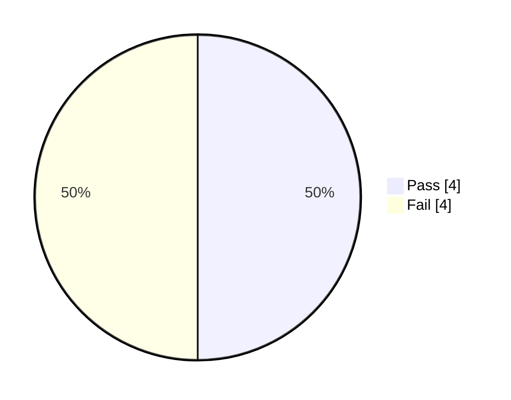

# 🧪 Postman Testing Report – E-Commerce API

## 1) Mục Tiêu

- Xác thực các luồng API chính bằng Postman: Signup/Login, xem sản phẩm, tạo đơn hàng, quản lý thương hiệu, review/comment, payment, admin.
- Kiểm tra bảo vệ endpoint (Authorization) và biến chuỗi (token, productId, orderId…).
- Ghi nhận kết quả thực thi (Status Code, thời gian) và so khớp với kỳ vọng.

---

## 2) Môi Trường & Tiền Điều Kiện

| Thành phần | Giá trị |
|------------|---------|
| Base URL | http://localhost:5100 |
| Backend | Đã khởi động (`npm start` trong thư mục Back-end) |
| Database | MongoDB đang chạy (`mongod`) + seed data |
| Postman Env Vars | `baseUrl`, `token`, `userId`, `productId`, `orderId`, `brandId`, `categoryId`, `reviewId`, `commentId`, `locationId` |

---

## 3) Collection & Run Log

- Collection sử dụng: [Postman_E-Commerce_API.postman_collection.json](Postman_E-Commerce_API.postman_collection.json)
- Run log tham chiếu (Postman export): “E-Commerce API - Complete Testing.postman_test_run.json” (ngoài workspace) – tóm tắt bên dưới.

---

## 4) Dữ Liệu Đầu Vào (Tiêu Biểu)

| Endpoint | Method | Headers | Body (rút gọn) | Kỳ vọng |
|----------|--------|---------|----------------|---------|
| AUTH-001: Signup | POST | Content-Type: application/json | `{ email: "testuser{{$timestamp}}@example.com", password: "Test@12345", passwordConfirm: "Test@12345", name: "Test User" }` | 201 Created + token |
| AUTH-002: Login | POST | Content-Type: application/json | `{ email: "admin@example.com", password: "admin123" }` | 200 OK + token |
| AUTH-004: UpdateMyPassword | PATCH | Authorization: Bearer {{token}} | `{ passwordCurrent: "admin123", password: "NewPass@123", passwordConfirm: "NewPass@123" }` | 200 OK |
| BRD-001: Create Brand | POST | Authorization: Bearer {{token}} | `{ name: "Samsung" }` | 201 Created (Admin-only) |
| ORD-001: Create Order | POST | Authorization: Bearer {{token}} | `{ products:[{ productId: {{productId}}, quantity:1 }], payments:"balance", deliveryAddress:"123 Main St" }` | 201 Created + orderId |
| REV-001: Create Review | POST | Authorization: Bearer {{token}} | `{ productId: {{productId}}, rating:5, comment:"Excellent" }` | 201 Created |

---

## 5) Cách Chạy

### Postman (UI)
1. Import collection: Postman → File → Import → chọn file collection.
2. Tạo environment “E-Commerce Local”: `baseUrl = http://localhost:5100`.
3. Chạy **Authentication** (Signup hoặc Login) để có `token`.
4. Chạy các folder tiếp theo theo thứ tự: Product → Order → Review/Comment → Brand/Category → Admin → Payment → Health.

### Newman (CLI – tùy chọn)
```powershell
# Cài đặt Newman (nếu chưa có)
npm install -g newman

# Chạy collection + xuất báo cáo JSON
newman run Postman_E-Commerce_API.postman_collection.json ^
  --env-var baseUrl=http://localhost:5100 ^
  --reporters cli,json ^
  --reporter-json-export ./postman_run_results.json
```

---

## 6) Kết Quả Thực Tế (Theo Run Log Đã Cung Cấp)

| Tên | URL | Time (ms) | Expected | Actual | Đánh giá |
|-----|-----|-----------|----------|--------|---------|
| AUTH-001: Signup | /api/v1/users/signup | 776 | 201 Created | 201 Created | PASS |
| AUTH-002: Login | /api/v1/users/login | 17 | 200 OK | 401 Unauthorized | FAIL |
| AUTH-003: Forgot Password | /api/v1/users/forgotPassword | 11 | 200/202 | 404 Not Found | FAIL |
| AUTH-004: Update My Password | /api/v1/users/updateMyPassword | 501 | 200 OK | 401 Unauthorized | FAIL |
| AUTH-005: Get My Info | /api/v1/users/me | 24 | 200 OK | 200 OK | PASS |
| BRD-001: Create Brand (Admin) | /api/v1/brands | 70 | 201 Created | 403 Forbidden | FAIL |
| BRD-002: Get All Brands | /api/v1/brands | 12 | 200 OK | 200 OK | PASS |
| BRD-003: Get Brand by ID | /api/v1/brands/{{brandId}} | 13 | 200 OK | 200 OK | PASS* |

Ghi chú: `BRD-003` phụ thuộc `brandId` (lưu sau khi tạo brand). Do create brand thất bại (403), cần có brandId hợp lệ để thực sự kiểm tra.

### Tóm Tắt
- Endpoints chạy: 8
- PASS: 4 | FAIL: 4
- Tổng thời gian: ~1424ms



---

## 7) Nhận Xét & Khuyến Nghị

- Auth:
  - Login (401): kiểm tra lại seed credentials (`admin@example.com`/`admin123`) hoặc cập nhật env.
  - UpdateMyPassword (401): cần `Authorization: Bearer {{token}}` hợp lệ (chạy login trước).
  - ForgotPassword (404): xác minh route `/api/v1/users/forgotPassword` và email tồn tại.
- Brand:
  - Create Brand (403): endpoint giới hạn admin; token hiện tại có thể là user token. Cần đăng nhập admin để nhận token quyền admin.
- Biến chuỗi:
  - Đảm bảo các request chạy theo trình tự để save `productId`, `orderId`, `brandId`.
- Assertions:
  - Nên thêm `pm.test(...)` cho từng request để kết quả PASS/FAIL hiển thị trong Runner, không chỉ status code.

Ví dụ assertion (Tests tab):
```javascript
pm.test("Status is 201", () => pm.response.code === 201);
const json = pm.response.json();
pm.test("Has data", () => json && json.data);
```

---

## 8) Kế Hoạch Rerun (Không bắt buộc)

1. Đăng nhập admin để lấy `token` admin (AUTH-002) → dùng cho BRD-001.
2. Thêm assertions cho các request quan trọng (status, schema tối thiểu).
3. Chạy lại flow: Signup/Login → Product (get/save productId) → Order (create/save orderId) → Review.
4. Tùy chọn: dùng Newman để xuất báo cáo JSON/HTML.

---

## 9) Phụ Lục – Biến Môi Trường Khuyến Nghị

| Biến | Mục đích |
|------|----------|
| baseUrl | Địa chỉ API |
| token | Bearer token cho endpoints cần auth |
| userId | ID user sau signup/login |
| productId | ID sản phẩm sau khi get detail |
| orderId | ID đơn hàng sau khi create |
| brandId | ID brand sau create |
| reviewId/commentId | IDs phục vụ review/comment |
