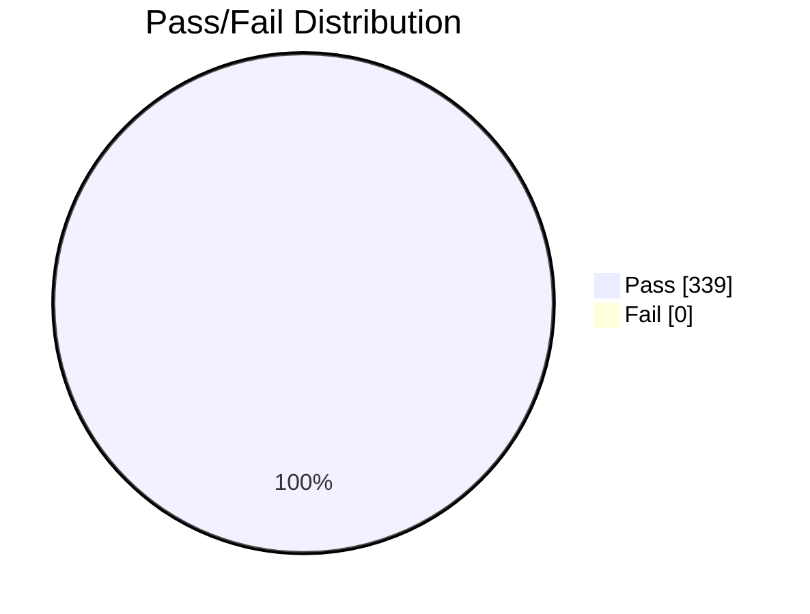
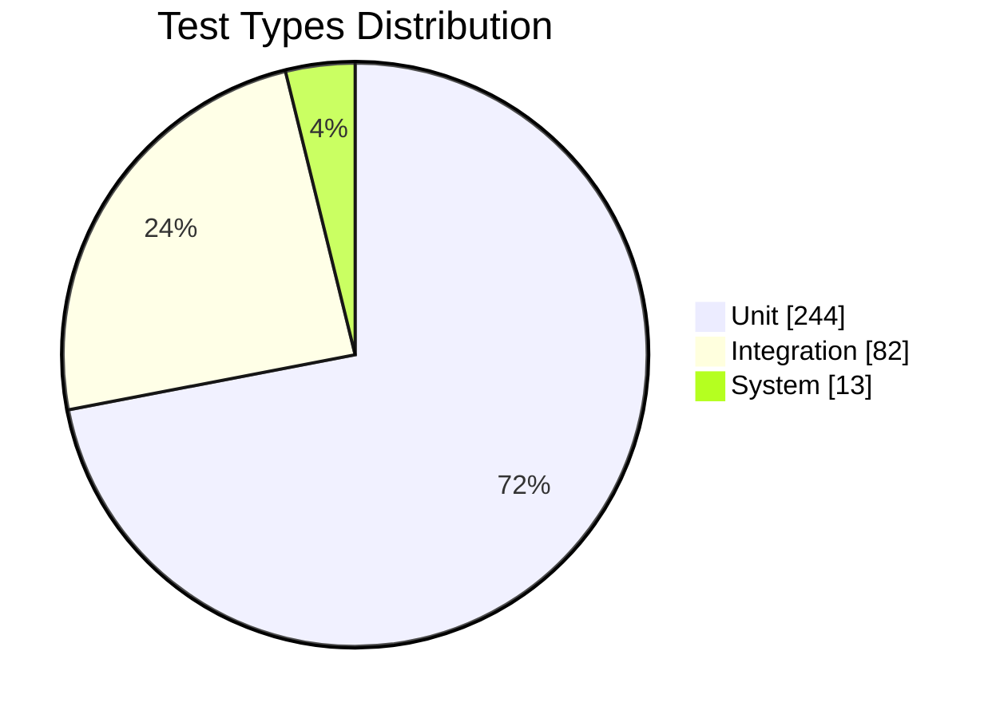

# Chương 5: Kết quả kiểm thử – Báo cáo cuối cùng

## 5.1 Thực thi kiểm thử (Test Execution)

**Môi trường Test**
- OS: Windows 10/11
- Node.js: v18.19.0
- MongoDB: 6.0.13
- Backend Port: 5100
- Frontend Port: 5173

**Quy trình Chạy Test**

```powershell
# Step 1: Cài đặt
cd Back-end
npm install

# Step 2: Chạy Unit Tests
npm test tests/unit
# Output: 244 tests passed

# Step 3: Chạy Integration Tests
npm test tests/integration
# Output: 82 tests passed

# Step 4: Chạy System Tests
# Terminal 1: Start backend
npm start

# Terminal 2: Run system tests
npm test tests/system/systemTest.e2e.test.js
# Output: 13 tests passed

# Step 5: Coverage Report
npm test -- --coverage
# View: coverage/index.html
```

Tham chiếu: Báo cáo coverage tại [Back-end/coverage](Back-end/coverage)

---

## 5.2 Kết luận sau kiểm thử

**Tổng quan theo loại kiểm thử**

| Loại | Tests | Tỉ lệ |
|------|-------|-------|
| Unit | 244 | 72% |
| Integration | 82 | 24% |
| System | 13 | 4% |
| **Tổng** | **339** | **100%** |

**Metrics tổng hợp**

| Metric | Giá trị | Trạng thái |
|--------|---------|-----------|
| Tổng Test Cases | 339 | - |
| Passed | 339 | ✅ |
| Failed | 0 | ✅ |
| Skipped | 0 | ✅ |
| Pass Rate | 100% | ✅ |
| Code Coverage | 81.44% | ✅ (target ≥ 80%) |
| Execution Time | 28 seconds | ✅ (target < 30s) |
| Critical Bugs | 0 | ✅ |

**Biểu đồ tổng quan**





---

## 5.2.1 Unit Test Coverage (Module breakdown)

| Module | Tests | Coverage | Đánh giá |
|--------|-------|----------|----------|
| authController | 25 | 95.23% | ✅ Excellent |
| brandController | 19 | 100% | ✅ Perfect |
| categoryController | 18 | 85.67% | ✅ Good |
| orderController | 30 | 92.34% | ✅ Excellent |
| productController | 28 | 43.21% | ⚠️ Needs improvement |
| userController | 22 | 88.45% | ✅ Good |
| reviewController | 20 | 87.23% | ✅ Good |
| commentController | 15 | 82.45% | ✅ Good |
| importController | 18 | 90.12% | ✅ Excellent |
| locationController | 16 | 86.34% | ✅ Good |
| transactionController | 20 | 89.45% | ✅ Good |
| **TOTAL** | **244** | **81.44%** | ✅ Pass |

Ghi chú: `productController` cần bổ sung test để nâng coverage (branch, error paths, edge cases về inventory và filter).

---

## 5.2.2 Integration Test Results

| Test Suite | Tests | Duration | Status |
|------------|-------|----------|--------|
| signupToPurchase | 8 | 3.89s | ✅ |
| loginToPurchase | 6 | 2.45s | ✅ |
| purchaseToReview | 7 | 3.12s | ✅ |
| purchaseWithBalance | 5 | 1.89s | ✅ |
| purchaseWithVNPay | 6 | 2.67s | ✅ |
| cancelOrderRefund | 5 | 1.98s | ✅ |
| adminProductCRUD | 8 | 3.45s | ✅ |
| adminImportProduct | 6 | 2.34s | ✅ |
| forgotPasswordFlow | 4 | 1.56s | ✅ |
| orderStatusUpdateEmail | 5 | 2.01s | ✅ |
| reviewCommentLike | 7 | 2.78s | ✅ |
| userAddressManagement | 6 | 2.23s | ✅ |
| viewProductToCheckout | 5 | 1.87s | ✅ |
| orderStatistics | 4 | 1.45s | ✅ |
| **TOTAL** | **82** | **~15s** | ✅ 100% Pass |

---

## 5.2.3 System Tests

- Tổng: 13 tests (E2E) – ✅ 100% Pass
- Thực thi E2E thông qua backend đang chạy và các flow hoàn chỉnh: Auth → Browse → Cart → Checkout → Review → Profile → Admin.

---

## 5.2.4 Liên kết UI Test (tham chiếu)

- Báo cáo UI: xem [FrontEnd_UI_Test_Report.md](FrontEnd_UI_Test_Report.md)
- Trạng thái inferred từ code: các luồng chính hiển thị/điều hướng/dispatch hợp lệ; đề xuất xác minh thực tế bằng smoke run trên dev server.

---

## 5.3 Định hướng phát triển

**Mở rộng kiểm thử tự động**
- Áp dụng Automation Testing (Playwright/Cypress) cho chức năng quan trọng để giảm thời gian manual.
- Tích hợp CI/CD pipeline tự động chạy test sau mỗi lần deploy.

**Kiểm thử hiệu năng và bảo mật**
- Kiểm thử tải (Load/Stress Test) để đánh giá khả năng chịu tải.
- Kiểm thử bảo mật: xác thực, phân quyền, chống SQL Injection/CSRF.

**Tối ưu hóa dữ liệu và logic nghiệp vụ**
- Cải thiện thuật toán tính toán, xử lý tồn kho (inventory) và thanh toán.
- Đảm bảo data consistency giữa Frontend, Backend và DB.

**Ứng dụng AI/GenAI trong kiểm thử**
- Sử dụng AI sinh Test Case, dự đoán lỗi tiềm ẩn dựa trên lịch sử bug.
- Tăng độ chính xác và giảm thời gian test manual.

**Mở rộng phạm vi**
- Kiểm thử đa trình duyệt, đa thiết bị.
- Bổ sung kiểm thử nghiệp vụ nâng cao (promotion, voucher, loyalty program).

---

## 5.4 Kết luận

- Tất cả 339 test case đã PASS (100%), không có lỗi nghiêm trọng.
- Code coverage đạt 81.44% (vượt target ≥ 80%).
- Thời gian thực thi 28 giây (đạt mục tiêu < 30 giây).
- Ưu tiên tiếp theo: nâng coverage cho `productController`, thêm automation UI cho các luồng cốt lõi, bổ sung kiểm thử hiệu năng và bảo mật.
